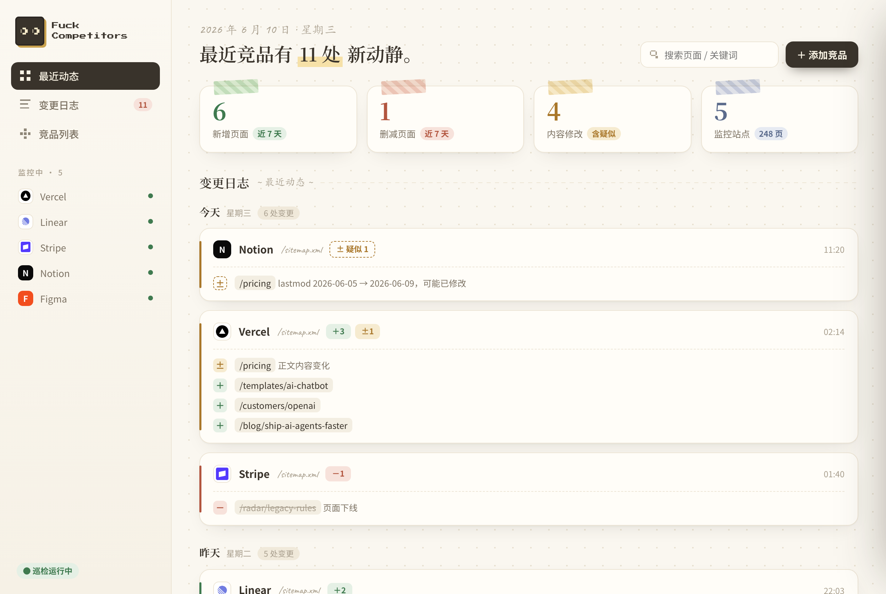
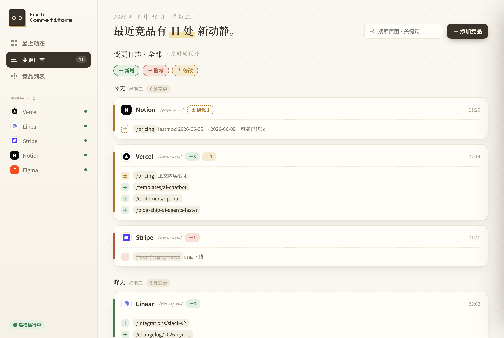
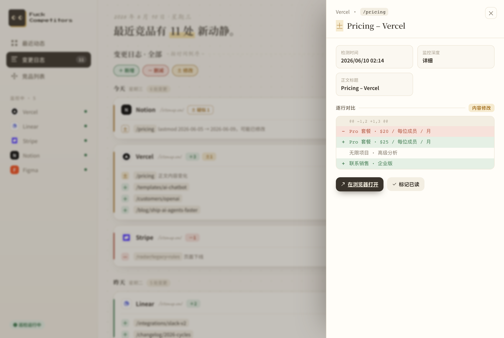
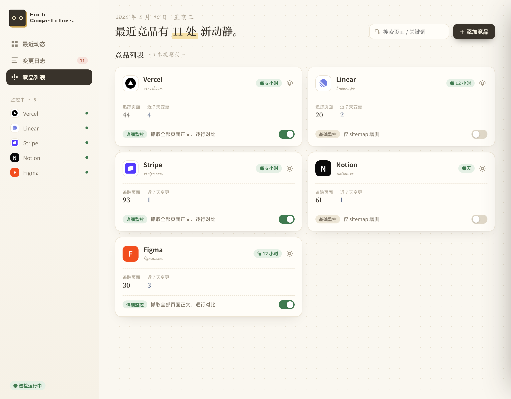

<div align="center">

# Fuck Competitors

**盯紧竞争对手的网站，把每一次变化都记成日志。**

[](https://github.com/tod-zhang/fuck-competitors/actions/workflows/ci.yml)
[](LICENSE)
[](https://www.python.org/)
[](Dockerfile)

一个自托管、开源的竞品监控应用。填入竞品的 `sitemap.xml`，它会定期巡检页面的
**新增 / 删减 / 修改**，像写观察日记一样记录下来。温暖的手账风界面，自带像素眼睛吉祥物。

</div>

## 界面截图

| 最近动态 | 变更日志 |
| --- | --- |
|  |  |
| **内容 diff** | **竞品列表** |
|  |  |

---

## 功能特性

- 📒 **变更日志** —— 竞品页面的新增、删减、内容修改，按日期分组、时间倒序，可按竞品和变更类型筛选
- 🔍 **两层监控** —— 轻量的 sitemap 增删监控（全站）+ 可选的正文逐行 diff（按竞品开启）
- 🧠 **AI 分析（MCP）** —— 内置只读 MCP server，把变化和 diff 开放给 Claude Code / Codex 等 Agent，直接分析"对手在优化什么"
- 🤫 **静默基线** —— 首次巡检只记录"现在有哪些页"，不会用初始清单刷屏日志
- ⚙️ **竞品设置** —— 随时改名称 / sitemap 地址 / 巡检频率、立即巡检、删除竞品
- 🐳 **一条命令部署** —— 单容器 + 单个 SQLite 文件，无需任何外部服务
- 🪶 **无前端构建** —— 服务端渲染 + 原生 JS，克隆即跑

## 快速开始

```bash
docker compose up
# 打开 http://localhost:9527
```

就这样 —— 一个容器、一个 SQLite 文件（持久化在 `fc-data` 数据卷里），不依赖任何外部服务。

## 安装方式

### 方式一：Docker（推荐）

```bash
git clone https://github.com/tod-zhang/fuck-competitors.git
cd fuck-competitors
docker compose up -d          # 后台运行
# 打开 http://localhost:9527
```

数据持久化在 `fc-data` 卷中。需要重置为空白：`docker compose down -v` 后再 `up`。

### 方式二：源码本地运行

```bash
git clone https://github.com/tod-zhang/fuck-competitors.git
cd fuck-competitors

python3 -m venv .venv && . .venv/bin/activate
pip install -r requirements.txt

uvicorn app.main:app --port 9527        # 打开 http://localhost:9527
```

> ⚠️ 调度器跑在进程内，请用**单个 worker**（默认即是）。多 worker 会重复触发巡检。

## 使用流程

1. **添加竞品** —— 点「＋ 添加竞品」，填竞品的 `sitemap.xml`，选巡检频率。
   首次巡检是**静默建基线**：只记录当前全部页面，**不会**给每个页面灌一条"新增"
   —— 初始清单里没有"变化"这个信号。
2. **让它跑** —— 每个竞品按各自频率自动重抓（或在卡片设置里点「立即巡检」马上查一次）。
   从第二次巡检起，只有真正的 **新增 / 删减 / 疑似修改** 才会进变更日志。
3. **盯关键内容** —— 想看定价、文案、客户案例的**逐行内容 diff**，在「竞品列表」里
   对该竞品打开**详细监控**开关。开启后，每次详细巡检会抓取它**全部页面**的正文做对比，
   记录到底改了什么。

## AI 分析（MCP）

应用自带一个**只读 MCP server**，把竞品的变化和内容 diff 以工具形式开放给 AI Agent
（Claude Code / Codex / Claude Desktop 等），让你直接问 *“竞品 X 最近在优化什么？”* ——
Agent 会拉取最近的变化和逐行 diff 自己推理。

工具：`list_competitors` · `get_changes` · `get_diff` · `get_page_history` · `summarize_window`

在 Claude Code 里接入（项目根目录建 `.mcp.json`）：

```json
{
  "mcpServers": {
    "fuck-competitors": {
      "command": ".venv/bin/python",
      "args": ["-m", "app.mcp_server"],
      "env": { "FC_DB_URL": "sqlite:///./data/app.db" }
    }
  }
}
```

然后就能问：「用 summarize_window 看 cowseal 最近 14 天，它在优化什么？」

### HTTP / 远程（自托管后直接输 URL）

`docker compose up` 会同时启动一个 **MCP HTTP 服务(端口 9528)**,和应用共用同一个数据库。
在支持远程 MCP 的客户端(Claude Desktop / ChatGPT 连接器 / Claude Code `--transport http`)里直接填:

```
http://<你的服务器>:9528/mcp
```

> 🔒 **安全**:这个端点是**只读但会暴露你监控的竞品与 diff**。仅本机/内网用可不设鉴权;
> **暴露到公网必须设 `FC_MCP_TOKEN`**(在 compose 的 `mcp` 服务里),客户端连接时带
> `Authorization: Bearer <token>`。

## 监控原理（两层）

| 层级 | 做什么 | 成本 | 覆盖 |
| --- | --- | --- | --- |
| **基础**（始终开启） | 每次巡检 diff sitemap → 页面**新增 / 删减**；若页面带 `<lastmod>`，时间戳变化会标记一条**「疑似修改」** | 低 | 全部页面 |
| **详细**（每个竞品可选） | 抓取该竞品**全部页面**的正文，逐行 **内容 diff** —— 抓到定价 / 定位 / 文案的具体改动 | 中 | 全部页面（受上限约束） |

> **诚实说明**：基础监控只能"**疑似**"判断修改（且仅当站点诚实填写了 `<lastmod>`），
> 它永远看不到*改了什么*。要看到真正的逐行 diff，必须开启详细监控。界面上这两者刻意区分清楚。

详细监控对全站正文做对比，比只盯几页更吃资源、噪音也更大 —— 所以它**默认关闭、按竞品单独开**，
并用 `FC_DETAILED_MAX_PAGES`（默认 500）兜底，避免超大站把自己拖垮。

## 配置

所有配置都是 `FC_` 前缀的环境变量（见 `.env.example`）：

| 变量 | 默认值 | 含义 |
| --- | --- | --- |
| `FC_DB_URL` | `sqlite:///./data/app.db` | 数据库位置 |
| `FC_DEFAULT_INTERVAL_HOURS` | `12` | 默认巡检间隔 |
| `FC_REQUEST_TIMEOUT` | `20` | 单次请求超时（秒） |
| `FC_MAX_SITEMAP_URLS` | `50000` | 单个 sitemap 的抓取上限 |
| `FC_DETAILED_MAX_PAGES` | `500` | 每次详细巡检内容对比的页面上限 |
| `FC_WRITE_BATCH` | `200` | 巡检写库每 N 行提交一次（频繁释放写锁，避免阻塞并发添加） |
| `FC_SNAPSHOT_RETENTION` | `10` | 每个页面保留的内容快照数 |
| `FC_USER_AGENT` | `FuckCompetitors/0.1 …` | 抓取时使用的 User-Agent |

## 开发

```bash
python3 -m venv .venv && . .venv/bin/activate
pip install -r requirements.txt
uvicorn app.main:app --reload --port 9527   # http://localhost:9527

python tests/test_basic.py             # sitemap 解析 + 增删改 diff（纯标准库）
python tests/test_security.py          # 拒绝 XXE / 实体炸弹的 sitemap
python tests/e2e_local.py              # 全链路：抓取 → diff → 落库（本地 HTTP 服务）
python tests/seed_demo.py              # 灌入演示数据，方便逛界面
```

## 架构

- **FastAPI** 应用，服务端渲染 **Jinja2** 模板（无构建步骤），抽屉 / 设置 / 筛选用原生 `fetch` + 少量 JS。
- **APScheduler** 每个竞品一个进程内定时任务 → **请用单 worker 运行**。
- **SQLite**（经 SQLModel）：`competitors / pages / changes / snapshots` 四张表。
- `app/monitor/` 是零依赖的核心：`sitemap.py`（抓取 + 解析）、`basic.py`（增删改 diff）、
  `detailed.py`（正文抓取 + 提取）、`diff.py`（逐行 diff）、`favicon.py`（站点图标解析）。

```
app/
├── main.py          # FastAPI 入口 + lifespan（启动调度器）
├── web.py           # 页面路由 + 表单/接口端点
├── service.py       # 巡检编排（基础 + 详细）
├── scheduler.py     # APScheduler 定时任务
├── models.py        # SQLModel 表
├── viewmodels.py    # DB 行 → 模板数据
├── config.py · db.py · timeutil.py
├── monitor/         # sitemap.py · basic.py · detailed.py · diff.py · favicon.py
├── templates/       # index.html + partials/(drawer.html · settings.html)
└── static/          # app.css · app.js · favicon.svg
```

## 安全说明

- Sitemap 是不可信输入，XML 用 **defusedxml** 解析（防 XXE / 实体展开攻击），并有回归测试覆盖。
- 抓取时设置了自定义 `User-Agent` 和超时；请做个好公民，用合理的巡检间隔。
- 站点图标（favicon）由用户浏览器直接向竞品站点请求，并带 `no-referrer`，不经任何第三方。

## 许可证

MIT
